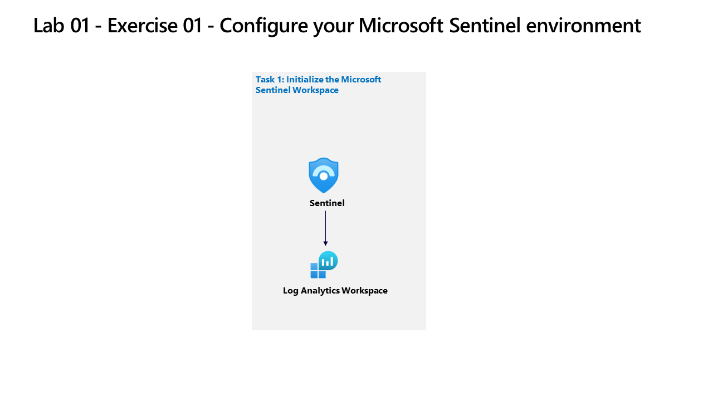

---
lab:
  title: "Aufgabe\_01: Bereitstellen von Microsoft Sentinel"
  module: Guided Project - Create and configure a Microsoft Sentinel workspace
---

>**Hinweis**: Zur Durchführung dieses Labs benötigen Sie ein [Azure-Abonnement](https://azure.microsoft.com/en-us/free/?azure-portal=true). In dem Sie über Administratorzugriff verfügen.

## Allgemeine Richtlinien zu 

- Verwenden Sie beim Erstellen von Objekten die Standardeinstellungen, es sei denn, es gibt Anforderungen, die unterschiedliche Konfigurationen erfordern.
- Erstellen, löschen oder bearbeiten Sie Objekte nur dann, wenn dies zum Erfüllen der Anforderungen dient. Unnötige Änderungen an der Umgebung können sich negativ auf Ihre Endbewertung auswirken.
- Wenn es mehrere Möglichkeiten gibt, ein Ziel zu erreichen, wählen Sie immer den Ansatz, der den geringsten Verwaltungsaufwand erfordert.

Wir evaluieren derzeit den bestehenden Sicherheitsstatus unserer Unternehmensumgebung. Wir benötigen Ihre Hilfe bei der Einrichtung einer Lösung für das Security Information & Event Management (SIEM), um zukünftige und laufende Cyberangriffe zu erkennen.

## Architekturdiagramm

## Qualifikationsaufgabe

Sie müssen einen Microsoft Sentinel-Arbeitsbereich einrichten. Die Lösung muss die folgenden Anforderungen erfüllen:

- Stellen Sie sicher, dass die Sentinel-Daten in der Azure-Region USA, Westen gespeichert werden.
- Stellen Sie sicher, dass alle Sentinel-Analyseprotokolle 180 Tage lang aufbewahrt werden.
- Weisen Sie Operator1 Rollen zu, um sicherzustellen, dass Operator1 Vorfälle verwalten und Sentinel-Playbooks ausführen kann. Die Lösung muss dem Grundsatz der geringsten Berechtigung entsprechen.

## Übungsanweisungen

### Aufgabe 1: Erstellen eines Log Analytics-Arbeitsbereichs

Erstellen Sie einen Log Analytics-Arbeitsbereich, einschließlich der Regionsoption. Weitere Informationen zu [Onboarding in Microsoft Sentinel](https://learn.microsoft.com/azure/sentinel/quickstart-onboard).

  1. Suchen Sie im Azure-Portal nach `Microsoft Sentinel` und wählen Sie es aus.
  1. Wählen Sie **+ Erstellen** aus.
  1. Klicken Sie auf **Create a new workspace** (Neuen Arbeitsbereich erstellen).
  1. Wählen Sie `RG2` als Ressourcengruppe aus.
  1. Geben Sie einen gültigen Namen für den Log Analytics-Arbeitsbereich ein.
  1. Wählen Sie `West US` als Region für den Arbeitsbereich.
  1. Wählen Sie **Überprüfen + Erstellen**, um den neuen Arbeitsbereich zu bestätigen.
  1. Wählen Sie **Erstellen**, um den Arbeitsbereich bereitzustellen.

### Aufgabe 2: Bereitstellen von Microsoft Sentinel in einem Arbeitsbereich

Bereitstellen von Microsoft Sentinel in einem Arbeitsbereich.

  1. Wenn die Bereitstellung von `workspace` abgeschlossen ist, wählen Sie **Aktualisieren**, um den neuen `workspace` anzuzeigen.
  1. Wählen Sie den `workspace`, dem Sie Sentinel hinzufügen möchten (erstellt in Aufgabe 1).
  1. Wählen Sie **Hinzufügen**.

### Aufgabe 3: Zuweisen einer Microsoft Sentinel-Rolle zu eine*r Benutzer*in

Weisen Sie einer Verwendung eine Microsoft Sentinel-Rolle zu. Erfahren Sie mehr über [Rollen und Berechtigungen für die Arbeit in Microsoft Sentinel](https://learn.microsoft.com/azure/sentinel/roles).

  1. Wechseln Sie zur Ressourcengruppe RG2.
  1. Wählen Sie **Zugriffssteuerung (IAM)** aus.
  1. Wählen Sie **Hinzufügen** und `Add role assignment` aus.
  1. Suchen Sie in der Suchleiste nach der Rolle `Microsoft Sentinel Contributor` und wählen Sie sie aus.
  1. Wählen Sie **Weiter** aus.
  1. Wählen Sie die `User, group, or service principal`-Option aus.
  1. Wählen Sie **+ Mitglieder auswählen** aus.
  1. Suchen Sie nach dem `Operator1`, welcher in Ihrer Labanweisung `(operator1-XXXXXXXXX@LODSPRODMCA.onmicrosoft.com)` zugeordnet ist.
  1. Wählen Sie `user icon` aus.
  1. Wählen Sie **Auswählen**.
  1. Wählen Sie „Überprüfen und zuweisen“ aus.
  1. Wählen Sie „Überprüfen und zuweisen“ aus.

### Aufgabe 4: Konfigurieren der Datenaufbewahrung

Konfigurieren der Datenaufbewahrung: [Erfahren Sie mehr über die Datenaufbewahrung](https://learn.microsoft.com/azure/azure-monitor/logs/data-retention-archive).

  1. Gehen Sie zu dem in Aufgabe 1 Schritt 5 erstellten `Log Analytics workspace`.
  1. Wählen Sie **Nutzungs- und geschätzte Kosten** aus.
  1. Wählen Sie **Datenaufbewahrung** aus.
  1. Ändern Sie den Daten-Aufbewahrungszeitraum auf **180 Tage**.
  1. Wählen Sie **OK** aus.

>**Hinweis**: Für zusätzliche Übungen absolvieren Sie das Modul [Erstellen und Verwalten von Microsoft Sentinel-Arbeitsbereichen](https://learn.microsoft.com/training/modules/create-manage-azure-sentinel-workspaces/).
